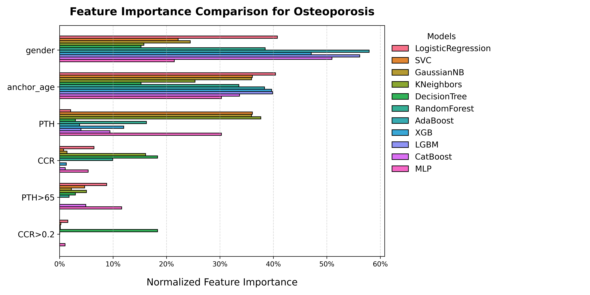

# Osteoporosis Prediction in Hospitalised Patients using Machine Learning

This project aims to develop a supervised machine learning model to predict osteoporosis risk in hospitalised patients, leveraging patient data related to Parathyroid Hormone (PTH) levels and urinary calcium-to-creatinine ratio (CCR). By identifying high-risk individuals early, this model can assist medical professionals in implementing timely interventions and personalized care.

## Project Structure

The project folder is organized as follows:

```plaintext
├── notebook
│   ├── data_collection.ipynb         # Data collection process using MIMIC-IV dataset
│   ├── data_visualisation.ipynb      # Exploratory Data Analysis
│   ├── data_processing.ipynb         # Data cleaning and preprocessing
│   ├── data_modeling.ipynb           # Model training, evaluation, and feature analysis
│
├── data
│   ├── raw_Ost_LabEvents.csv         # Original raw dataset collected from MIMIC-IV
│   ├── processed_Ost_LabEvents.csv   # Cleaned dataset ready for modeling
│
├── plot
│   ├── ost_kdeplot.png               # Kernel densify plot for PTH and CCR
│   ├── ost_violinplot.png            # Violion plot for PTH and CCR
│   ├── ost_feature_importance.png    # Feature weigths plot from various ML models
│
├── model
│   ├── ost_feature_importance.json      # Feature weights calculated by various ML models
│
```
## Project Overview

### Research Objective
The goal of this project is to predict osteoporosis risk in hospitalised patients based on PTH levels and CCR values. The model is designed to help healthcare professionals identify high-risk individuals, ultimately supporting preventive measures and improved patient outcomes.

### Dependencies
All required Python libraries are listed in `requirements.txt`:

```plaintext
catboost==1.2.7
imblearn==0.0
lightgbm==4.5.0
matplotlib==3.7.2
numpy==1.24.3
pandas==2.0.3
pandas_gbq==0.24.0
protobuf==3.20.3
scikit_learn==1.3.2
seaborn==0.13.2
shap==0.46.0
xgboost==2.1.2
```
To install these dependencies, run:

```bash
pip install -r requirements.txt
```

### Methodology

The project follows a structured pipeline comprising data collection, preprocessing, modeling, and evaluation steps:

1. Data Collection (`data_collection.ipynb`):

    - Sources hosp patient data from the MIMIC-IV dataset.

    - Filters relevant items (e.g., PTH and CCR) for osteoporosis risk prediction.
2. Data Visualisation (`data_visualisation.ipynb`):
        - Prepare and clean data by renaming columns, mapping values, and calculating metrics.
        - Visualise distributions of PTH and CCR by age and osteoporosis status using KDE plots.
        - Create violin plots to compare the distribution of PTH and CCR across genders and osteoporosis status.
3. Data Processing (`data_processing.ipynb`):
    - Cleans the collected data, handling missing values, normalizing features, and encoding categorical variables.

    - Prepares a processed dataset (`processed_Ost_LabEvents.csv`) for modeling.
4. Modeling and Evaluation (`data_modeling.ipynb`):

    - Trains and evaluates machine learning models (e.g., Logistic Regression, Random Forest, Support Vector Machine).

    - Uses techniques like SMOTE for handling class imbalance.

    - Evaluates model performance using precision, recall, F1-score, and ROC-AUC.
    - Conducts feature importance analysis and visualizes significant predictors.

### Data Files

- `raw_Ost_LabEvents.csv`: The original raw dataset extracted from MIMIC-IV for hospitalised patients.
- `processed_Ost_LabEvents.csv`: The processed version of the raw dataset, cleaned and prepped for model training.

### Plots

- `ost_feature_importance.png`: A plot illustrating the most important features for predicting osteoporosis.

- `ost_kdeplot.png`: A KDE plot showing distributions of PTH and CCR by age and osteoporosis status.

- `ost_violionplot.png`: A violion plot showing distributions of PTH and CCR by gender and osteoporosis status.

## Results
The modeling process produced a machine learning model capable of predicting osteoporosis with notable accuracy, identifying key predictors in hospitalised patients. By interpreting feature importance through plots, we gain insights into which variables, such as PTH and CCR, most significantly influence the model's predictions.

### Model Results


| Osteoporosis       | precision | recall   | f1-score | accuracy | ROC-AUC  |
| ------------------ | --------- | -------- | -------- | -------- | -------- |
| LogisticRegression | 0.93      | 0.66     | 0.75     | 0.66     | 0.80     |
| SVC                | 0.93      | 0.66     | 0.75     | 0.66     | 0.81     |
| GaussianNB         | 0.93      | 0.73     | 0.80     | 0.73     | 0.77     |
| KNeighbors         | 0.93      | **0.79** | **0.84** | **0.79** | 0.80     |
| DecisionTree       | 0.92      | 0.75     | 0.81     | 0.75     | 0.79     |
| RandomForest       | 0.93      | 0.71     | 0.78     | 0.71     | **0.82** |
| AdaBoost           | 0.93      | 0.68     | 0.76     | 0.68     | 0.81     |
| XGB                | 0.93      | 0.71     | 0.78     | 0.71     | 0.81     |
| LGBM               | 0.93      | 0.72     | 0.79     | 0.72     | 0.81     |
| CatBoost           | 0.93      | 0.71     | 0.79     | 0.71     | **0.82** |
| MLP                | 0.93      | 0.72     | 0.79     | 0.72     | 0.81     |


### Feature Importance Accross different ML Models 



## How to Run

- Data Collection: Open `data_collection.ipynb` and run each cell to collect data from MIMIC-IV.

- Data Processing: Run `data_processing.ipynb` to clean and preprocess the collected data.

- Data Visualisation: Run `data_visualisation.ipynb` to visualise the distributions of collected data.

- Model Training and Evaluation: Open `data_modeling.ipynb` to train the model, optimize hyperparameters, and evaluate performance. Use the plot folder for visualization of feature importance.

## Reference

1. Johnson, A., Bulgarelli, L., Pollard, T., Gow, B., Moody, B., Horng, S., Celi, L. A., & Mark, R. (2024). MIMIC-IV (version 3.1). PhysioNet. https://doi.org/10.13026/kpb9-mt58.

2. Johnson, A.E.W., Bulgarelli, L., Shen, L. et al. MIMIC-IV, a freely accessible electronic health record dataset. Sci Data 10, 1 (2023). https://doi.org/10.1038/s41597-022-01899-x

3. Goldberger, A., Amaral, L., Glass, L., Hausdorff, J., Ivanov, P. C., Mark, R., ... & Stanley, H. E. (2000). PhysioBank, PhysioToolkit, and PhysioNet: Components of a new research resource for complex physiologic signals. Circulation [Online]. 101 (23), pp. e215–e220.

## Contact
For further information, please contact project team members:

- Chunxi Wang (ID: 1118838)
- Ze Pang (ID: 955698)
- Yuqi Wang (ID: 1445371)
- Pengyuan Yu (ID: 1433539)
